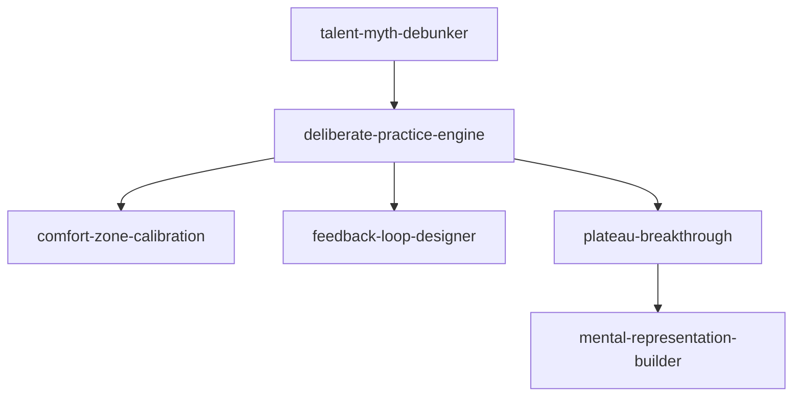

# INDEX — 《刻意练习》skill 地图

## 技能总览（6 个）

| skill | 一句话定位 | 触发关键词 |
|-------|-----------|-----------|
| deliberate-practice-engine | 诊断任何练习是否有效，输出升级处方 | 练习没用/怎么进步/这样练对吗 |
| comfort-zone-calibration | 判断挑战度是否到位（80/20 原则） | 舒适区/假努力/加大难度 |
| mental-representation-builder | 从新手思维升级到专家思维（三步入模） | 专家直觉/没框架/建立语感 |
| plateau-breakthrough | 瓶颈期换策略三步法 | 卡住了/练不上去/突破不了 |
| feedback-loop-designer | 无导师时搭建即时反馈系统 | 没老师/怎么复盘/如何检验 |
| talent-myth-debunker | 拆穿"天赋决定论"，转译为训练可及论 | 没天赋/TA是天才/学这个要天赋吗 |

## 引用图

- **engine** 是入口：先诊断，再分流
- **plateau** 卡住时调用 → 内部用 **representation-builder** 升级表征
- **feedback** 是 engine 的配套（诊断出反馈缺失时接 feedback）
- **talent-myth-debunker** 是心理入口：先破"没天赋"的障碍，才能启动 engine

## 使用路径建议

1. 新手起步：talent-myth-debunker（破障碍）→ deliberate-practice-engine（定方向）
2. 练了一段时间没感觉：deliberate-practice-engine（诊断）→ comfort-zone-calibration（查强度）
3. 明确卡住：plateau-breakthrough → mental-representation-builder
4. 自学无师：feedback-loop-designer
